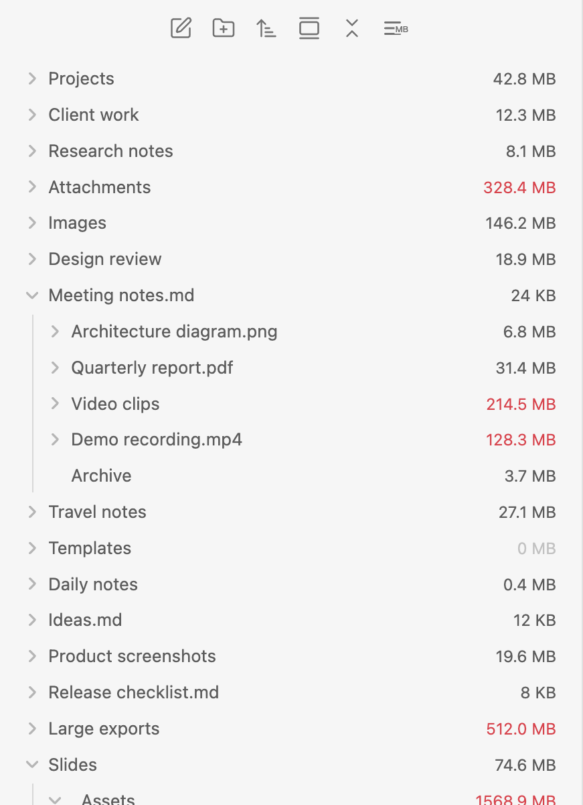
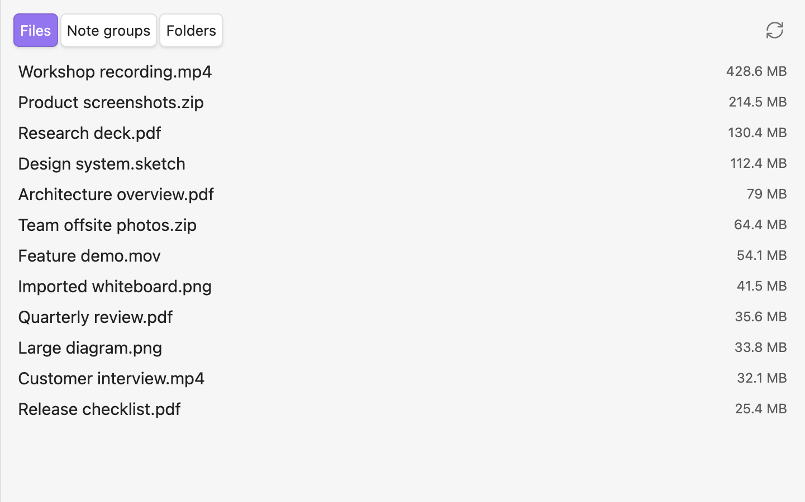
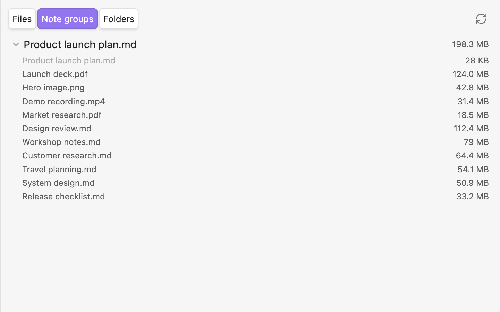

# File Explorer Size

Find what is taking up space in your Obsidian vault.

File Explorer Size is a desktop plugin that adds size labels to Obsidian's File Explorer and provides a ranking view for large files, folders, and notes with heavy attachments.



## Highlights

- Show file and recursive folder sizes in the File Explorer.
- Highlight large files and folders with configurable thresholds.
- Toggle size labels from the File Explorer toolbar.
- Open a ranking view for the largest files, note groups, and folders.
- Calculate a note's group size from the note plus its direct attachments.
- Optional MAKE.md Navigator support when MAKE.md is enabled.

## Size ranking

Use the ranking view to quickly find the biggest items in your vault.



The ranking view has three tabs:

- **Files**: physical file sizes.
- **Note groups**: each Markdown note plus its directly linked non-Markdown files.
- **Folders**: folders ranked by files directly inside them, excluding subfolders.

The **Folders** tab intentionally avoids showing every ancestor of a large nested folder. If `A/B/C/huge.mov` is the large file, the ranking points you to `A/B/C` instead of filling the list with `A`, `A/B`, and `A/B/C`.

## Note group sizes

A note group helps answer: "How much space does this note and its attachments use?"



A note group includes:

- The Markdown note itself.
- Directly linked non-Markdown files, such as images, PDFs, videos, and slide decks.

Markdown note links are not followed recursively. If the same attachment is linked multiple times in one note, it is counted and shown only once.

## Commands

- `Toggle File Browser sizes`
- `Open size ranking`
- `Recalculate all sizes`
- `Toggle MAKE.md Navigator sizes` — only available when MAKE.md is enabled

## MAKE.md support

MAKE.md support is optional. When MAKE.md is enabled, File Explorer Size can also show size labels in MAKE.md Navigator. When MAKE.md is disabled or not installed, MAKE.md settings and commands are hidden.

## Desktop only

This plugin is desktop only because it depends on Obsidian desktop File Explorer DOM structures.

## Known limitations

- Hidden configuration content such as `.obsidian` is not included because the plugin uses Obsidian's Vault API.
- The File Explorer DOM is not a formal public API. Future Obsidian or MAKE.md changes may require adapter updates.

## Development

```bash
pnpm install
pnpm test
pnpm lint
pnpm build
```

Release assets:

- `manifest.json`
- `main.js`
- `styles.css`

## License

MIT
